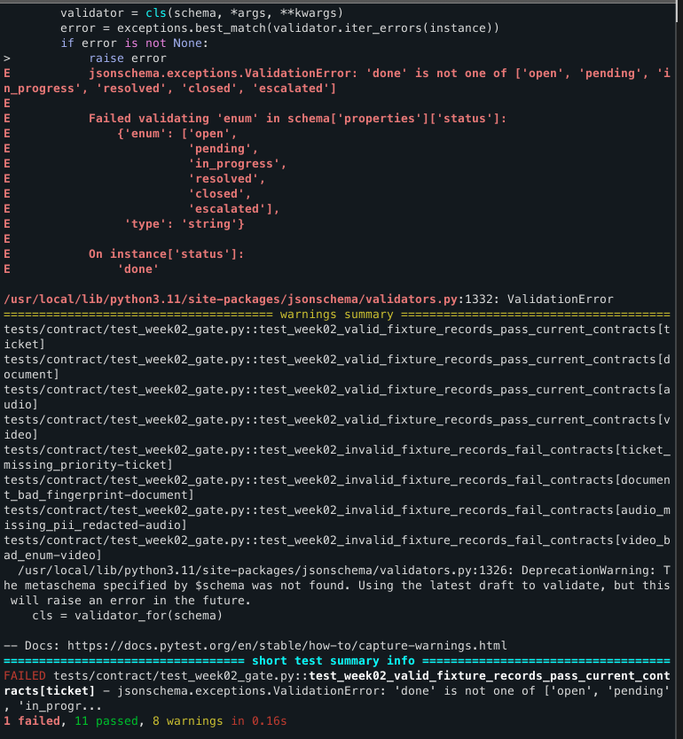
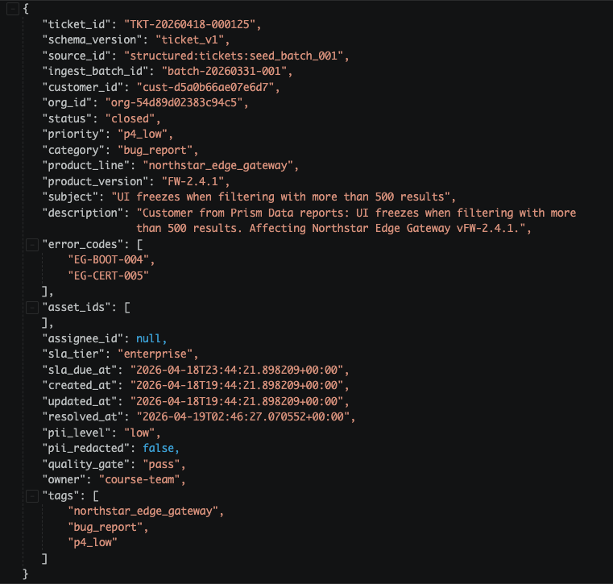
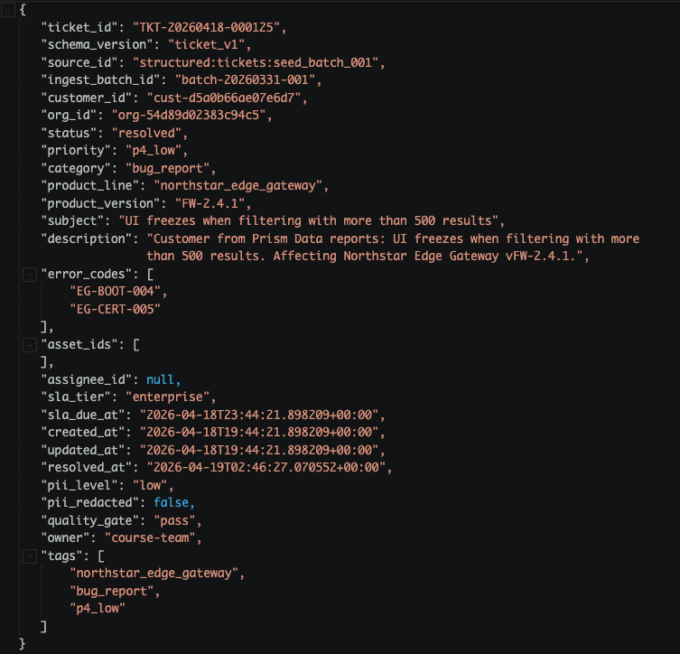
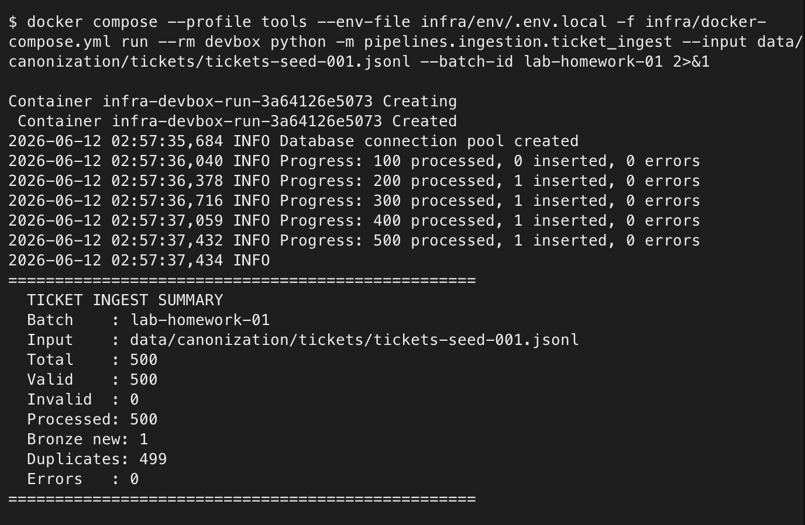
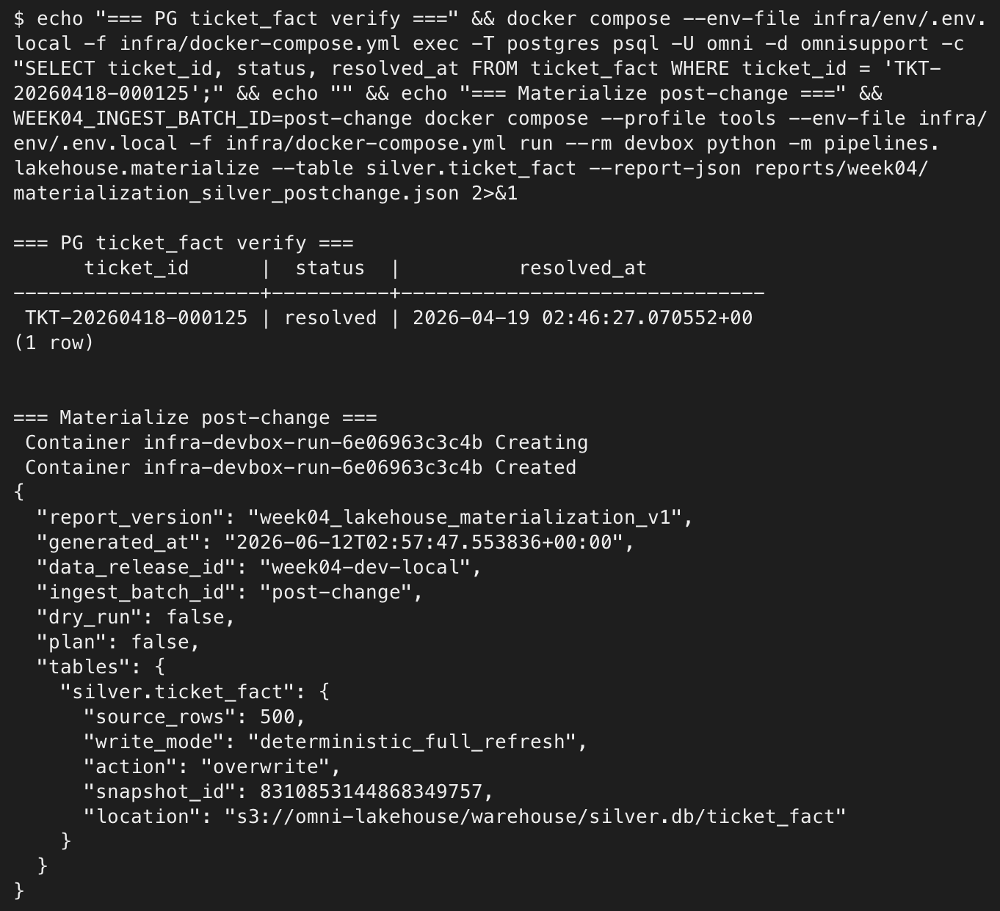
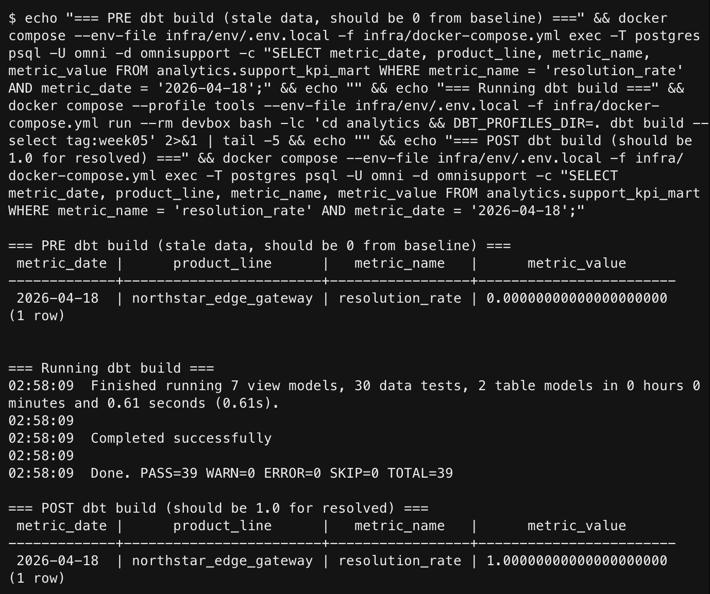
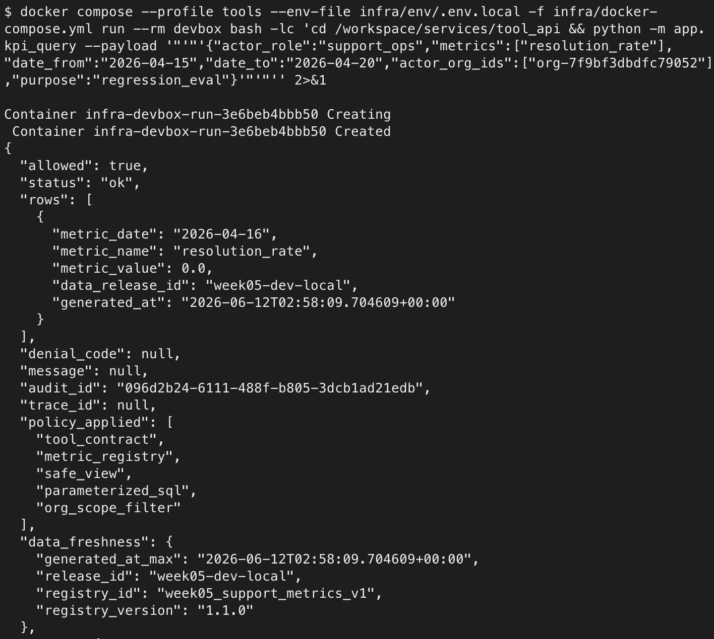
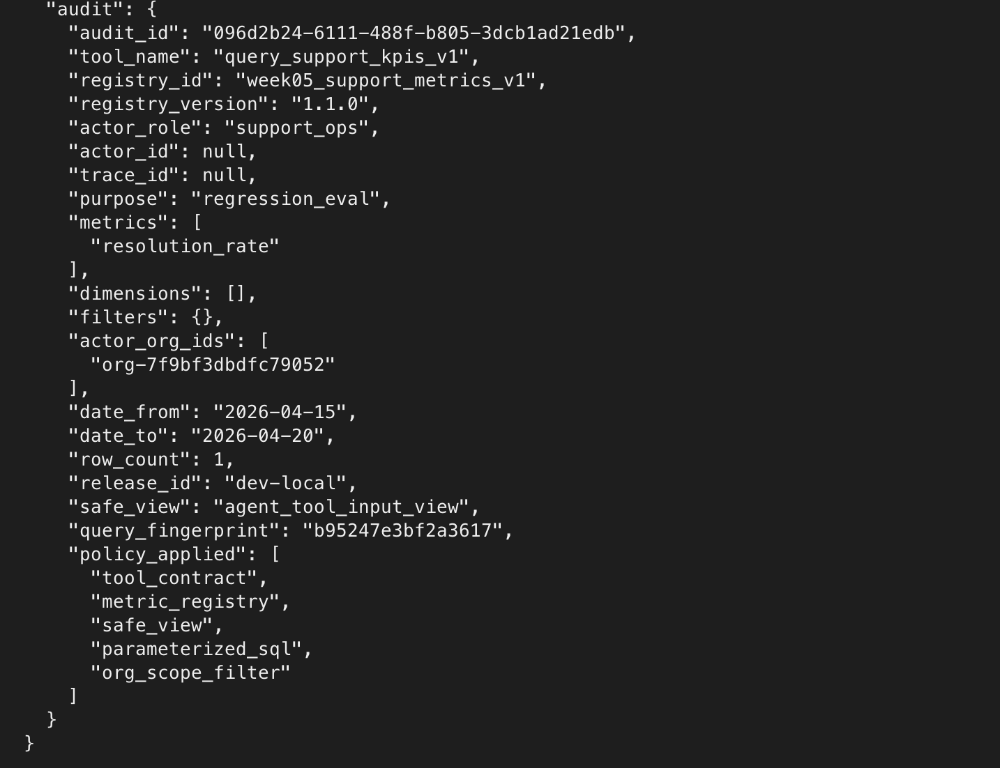
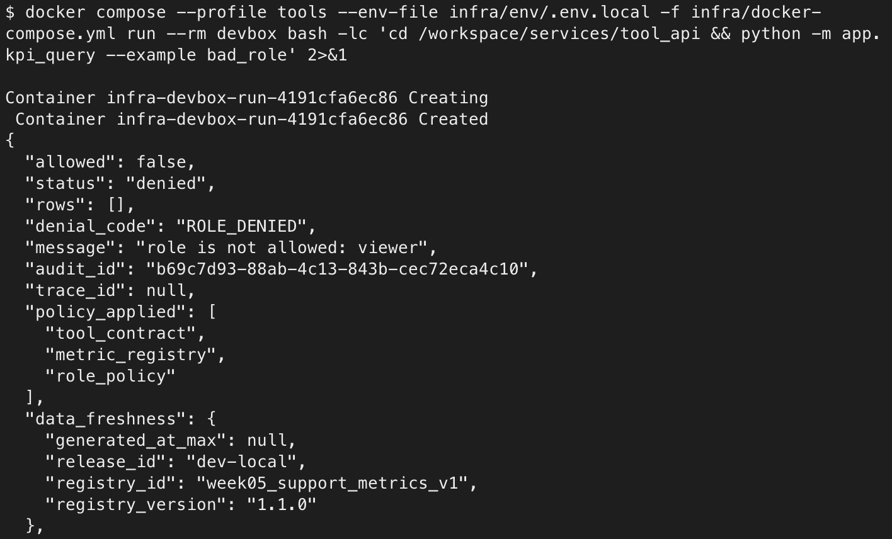
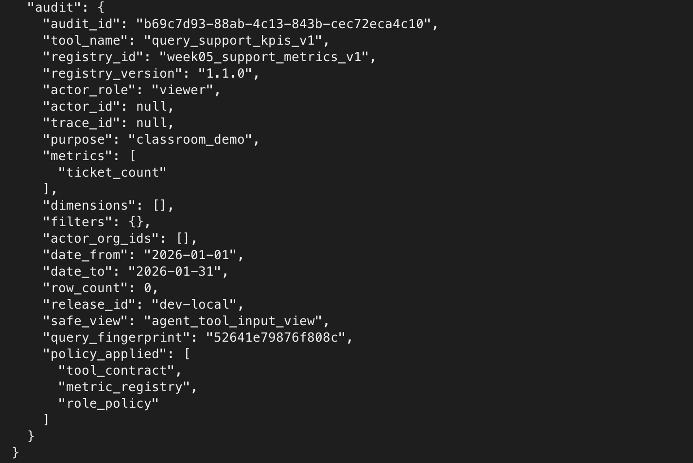

# 里程碑验收报告

## 0. 基本信息
- 姓名: 袁沛霖
- 仓库链接: [milestone/里程碑验收报告.md](https://github.com/ImageBreak/omnisupport-copilot/blob/5c848ed090e09e15165b1cf34b7b6b2efac05063/milestone/%E9%87%8C%E7%A8%8B%E7%A2%91%E9%AA%8C%E6%94%B6%E6%8A%A5%E5%91%8A.md)
- 选做指标: resolution_rate
- 完成档位:

## 1.指标口径（阶段一）
- 分子: status为resolved的工单数
- 分母: 总工单数
- 维度: metric_date * product_line * priority * org_id * category
- PII等级与理由: none, 这是一个纯粹的数值，不包含任何个人的身份信息。(但在后续metric_registry_v1.yml中增加该指标时，发现其余并不会对聚合指标定义PII等级，而是会定义sensitivity，这个被允许的值只有"low","medium","high"，若此处PII等级与sensitivity等价，应统一记录为low)
- 可查角色/HITL节点: support_ops / instructor / admin, 得到的值不在0～1之间时需要人工介入

## 2.契约门禁（阶段二）
- 用到的字段与枚举: 
  ```
    "status": {
      "type": "string",
      "enum": ["open", "pending", "in_progress", "resolved", "closed", "escalated"]
    },
    "created_at": {
      "type": "string",
      "format": "date-time"
    },
    "priority": {
      "type": "string",
      "enum": ["p1_critical", "p2_high", "p3_medium", "p4_low"]
    },
    "category": {
      "type": "string",
      "enum": [
        "installation", "configuration", "connectivity", "authentication",
        "billing", "feature_request", "bug_report", "documentation",
        "performance", "security", "other"
      ]
    },
    "org_id": {
      "type": "string",
      "description": "组织 ID，关联 entitlement_dim"
    },
    "product_line": {
      "type": "string",
      "enum": ["northstar_workspace", "northstar_edge_gateway", "northstar_studio", "cross_product"]
    },
  ```
  - 分母: 指定维度的总工单数量
  - 分子: 指定维度的工单中，status为resolved的工单数量
- 拦截演示证据:
  将一条数据的status修改为不存在的done后
  

## 3.入湖与补数（阶段三）
- 制造的缺口: 从raw_ticket_event和ticket_fact中人为删除了2026/4/15的工单数据。
```
DELETE FROM raw_ticket_event WHERE raw_payload->>'created_at' LIKE '2026-04-15%';
DELETE FROM ticket_fact WHERE created_at::date = '2026-04-15';
```
- 补数命令与结果：
```
docker compose --profile tools --env-file infra/env/.env.local \
  -f infra/docker-compose.yml run --rm devbox \
  python -m pipelines.ingestion.replay_backfill \
    --mode backfill \
    --source-id structured:tickets:seed_batch_001 \
    --batch-id lab-homework-01 \
    --input data/canonization/tickets/tickets-seed-001.jsonl \
    --execute

{
  "mode": "backfill",
  "source_id": "structured:tickets:seed_batch_001",
  "dry_run": false,
  "batch_id": "lab-homework-01",
  "start_cursor": null,
  "end_cursor": null,
  "checkpoint_snapshot": {
    "source_id": "structured:tickets:seed_batch_001",
    "last_processed_cursor": "2026-04-23T08:44:21.898209+00:00",
    "last_success_batch_id": "lab-homework-01",
    "last_run_id": "ticket-ingest::lab-homework-01",
    "updated_at": "2026-06-10T05:24:48.936524+00:00"
  },
  "execution_plan": [
    "Resolve source scope for structured:tickets:seed_batch_001.",
    "Inspect the latest ingest checkpoint before taking recovery action.",
    "Construct a historical cursor window and run the batch in dry-run first.",
    "Write a Week03 recovery decision report before touching downstream storage.",
    "Run ticket_ingest through the recovery entrypoint; non-dry-run execution uses the idempotent raw-event guard and checkpoint update."
  ],
  "warnings": [
    "Backfill mode expects both start_cursor and end_cursor."
  ],
  "recommended_action": "retry_after_metadata_repair",
  "status": "warning",
  "execution_result": {
    "total": 500,
    "valid": 500,
    "invalid": 0,
    "processed": 500,
    "inserted": 4,
    "skipped": 496,
    "errors": 0,
    "bronze_inserted": 4,
    "bronze_duplicates": 496,
    "silver_upserted": 500,
    "batch_id": "lab-homework-01",
    "input": "data/canonization/tickets/tickets-seed-001.jsonl",
    "dry_run": false,
    "state_path": "/workspace/data/canonization/checkpoints/week03_ingest_state.json",
    "checkpoints_written": 1
  },
  "generated_at": "2026-06-10T05:32:13.256756+00:00"
}
```

- 幂等如何保证: 
  - raw_ticket_event数据写入时，使用ON CONFLICT (source_id, source_fingerprint) DO NOTHING，保证数据不重复写入。
  - ticket_fact数据写入时，使用ON CONFLICT (ticket_id) DO UPDATE SET，保证数据如已存在就更新数据，缺失的就插入。

## 4.时间旅行与基线（阶段四）
- 补数前/后快照id:
  - 补数前快照:
    - bronze层raw_ticket_event快照id: 4464211956685227731
    - silver层ticket_fact快照id: 4730108476988074367 
  - 补数后快照：
    - bronze层raw_ticket_event快照id: 3638141864175584711
    - silver层ticket_fact快照id: 227425397357044849 
- 时间旅行记录
```
# Time travel bronze pre-backfill
$ docker compose --profile tools --env-file infra/env/.env.local -f infra/docker-compose.yml run --rm devbox python -m pipelines.lakehouse.demo_time_travel --table bronze.raw_ticket_event --snapshot-id 4464211956685227731 2>&1
Container infra-devbox-run-06119b0da902 Creating 
 Container infra-devbox-run-06119b0da902 Created 
{
  "report_version": "week04_time_travel_demo_v1",
  "generated_at": "2026-06-10T07:49:35.958162+00:00",
  "table": "bronze.raw_ticket_event",
  "snapshot_count": 7,
  "selected_snapshot_id": 4464211956685227731,
  "current_row_count": 500,
  "selected_snapshot_row_count": 496,
  "status": "ok",
  "notes": [
    "Use this demo after at least one successful materialization.",
    "For a stronger classroom demo, run materialization twice before comparing snapshots."
  ]
}

# Time travel bronze post-backfill
$ docker compose --profile tools --env-file infra/env/.env.local -f infra/docker-compose.yml run --rm devbox python -m pipelines.lakehouse.demo_time_travel --table bronze.raw_ticket_event --snapshot-id 3638141864175584711 2>&1
Container infra-devbox-run-dcc2ee04b844 Creating 
 Container infra-devbox-run-dcc2ee04b844 Created 
{
  "report_version": "week04_time_travel_demo_v1",
  "generated_at": "2026-06-10T07:49:36.839464+00:00",
  "table": "bronze.raw_ticket_event",
  "snapshot_count": 7,
  "selected_snapshot_id": 3638141864175584711,
  "current_row_count": 500,
  "selected_snapshot_row_count": 500,
  "status": "ok",
  "notes": [
    "Use this demo after at least one successful materialization.",
    "For a stronger classroom demo, run materialization twice before comparing snapshots."
  ]
}

# Time travel silver pre-backfill
$ docker compose --profile tools --env-file infra/env/.env.local -f infra/docker-compose.yml run --rm devbox python -m pipelines.lakehouse.demo_time_travel --table silver.ticket_fact --snapshot-id 4730108476988074367 2>&1
Container infra-devbox-run-46b0e3787038 Creating 
 Container infra-devbox-run-46b0e3787038 Created 
{
  "report_version": "week04_time_travel_demo_v1",
  "generated_at": "2026-06-10T07:49:41.246010+00:00",
  "table": "silver.ticket_fact",
  "snapshot_count": 7,
  "selected_snapshot_id": 4730108476988074367,
  "current_row_count": 500,
  "selected_snapshot_row_count": 496,
  "status": "ok",
  "notes": [
    "Use this demo after at least one successful materialization.",
    "For a stronger classroom demo, run materialization twice before comparing snapshots."
  ]
}

# Time travel silver post-backfill
$ docker compose --profile tools --env-file infra/env/.env.local -f infra/docker-compose.yml run --rm devbox python -m pipelines.lakehouse.demo_time_travel --table silver.ticket_fact --snapshot-id 227425397357044849 2>&1
Container infra-devbox-run-1bde738251fd Creating 
 Container infra-devbox-run-1bde738251fd Created 
{
  "report_version": "week04_time_travel_demo_v1",
  "generated_at": "2026-06-10T07:49:46.815229+00:00",
  "table": "silver.ticket_fact",
  "snapshot_count": 7,
  "selected_snapshot_id": 227425397357044849,
  "current_row_count": 500,
  "selected_snapshot_row_count": 500,
  "status": "ok",
  "notes": [
    "Use this demo after at least one successful materialization.",
    "For a stronger classroom demo, run materialization twice before comparing snapshots."
  ]
}
```

- 性能基线关键数字:
###### 1. `rows` — 业务完整性

| 表 | 行数 | 状态 |
|---|---|---|
| `bronze.raw_ticket_event` | 500 | 完整 |
| `silver.ticket_fact` | 500 | 完整 |
| `bronze.raw_doc_asset` | 4 | 正常 |
| `silver.knowledge_doc` | 4 | 正常 |

工单两张表都是 500 行，与种子文件 `tickets-seed-001.jsonl` 一致，补数操作已生效。

---

###### 2. `snapshots` — 历史版本

| 表 | snapshot 数 |
|---|---|
| `bronze.raw_ticket_event` | 7 |
| `silver.ticket_fact` | 7 |
| `bronze.raw_doc_asset` | 3 |
| `silver.knowledge_doc` | 3 |

工单表 7 个快照覆盖了多次物化 + 补数的完整轨迹(7个快照仅最后2个为此次作业形成的缺数和补数的快照，其余为课程学习时生成)。通过 `demo_time_travel --snapshot-id` 可回溯到补数前快照：

| 阶段 | bronze | silver |
|---|---|---|
| 补数前（缺数态） | `4464211956685227731` (496 行) | `4730108476988074367` (496 行) |
| 补数后（完整态） | `3638141864175584711` (500 行) | `227425397357044849` (500 行) |

**差异**: 4 行（2026-04-15 被补回的工单）

---

###### 3. `files` + `avg file size` — 存储健康

| 表 | 文件数 | 平均文件大小 |
|---|---|---|
| `bronze.raw_ticket_event` | 1 | 81,328 bytes |
| `bronze.raw_doc_asset` | 1 | 6,115 bytes |
| `silver.ticket_fact` | 1 | 29,328 bytes |
| `silver.knowledge_doc` | 1 | 6,813 bytes |

- 所有表均为单文件，无存储碎片
- 当前规模无需 compaction（文件合并）

---

###### 4. `latest operation` — 操作历史

| 表 | 最新操作 |
|---|---|
| `bronze.raw_ticket_event` | append |
| `bronze.raw_doc_asset` | append |
| `silver.ticket_fact` | append |
| `silver.knowledge_doc` | append |

> 注：`materialize.py` 使用 `table.overwrite()`，Iceberg 内部以 append 模式记录新快照，旧快照数据不会被物理删除（immutable design）。

---
## 5.dbt + 注册表 + 工具（阶段五）
- 改动文件清单(mart / view / registry / tool 契约)：
  - analytics/models/intermediate/int_ticket_activity_daily.sql
  - analytics/models/marts/support_kpi_mart.sql
  - analytics/models/marts/agent_tool_input_view.sql
  - analytics/models/marts/schema.yml
  - analytics/scripts/validate_metric_registry.py
  - analytics/metric_registry_v1.yml
  - analytics/tests/ratio_metrics_between_0_and_1.sql
- dbt build 结果:
```
02:49:01  Finished running 7 view models, 30 data tests, 2 table models in 0 hours 0 minutes and 0.64 seconds (0.64s).
02:49:01
02:49:01  Completed successfully
02:49:01
02:49:01  Done. PASS=39 WARN=0 ERROR=0 SKIP=0 TOTAL=39
```
- Week05 测试结果:
```
# 1. metric registry 注册表测试
docker compose --profile tools --env-file infra/env/.env.local \
  -f infra/docker-compose.yml run --rm devbox \
  pytest tests/integration/test_week05_metric_registry.py -q

..                                                                                     [100%]
2 passed in 0.03s

# 2. KPI query tool 集成测试
docker compose --profile tools --env-file infra/env/.env.local \
  -f infra/docker-compose.yml run --rm devbox \
  pytest tests/integration/test_week05_kpi_query_tool.py -q

.......                                                                                [100%]
7 passed in 0.18s

# 3. 合约校验测试
docker compose --profile tools --env-file infra/env/.env.local \
  -f infra/docker-compose.yml run --rm devbox \
  pytest tests/contract/test_week05_metric_contracts.py -q

..                                                                                     [100%]
====================================== warnings summary ======================================
tests/contract/test_week05_metric_contracts.py::test_query_support_kpis_contract_matches_tool_schema
  /usr/local/lib/python3.11/site-packages/jsonschema/validators.py:1326: DeprecationWarning: The metaschema specified by $schema was not found. Using the latest draft to validate, but this will raise an error in the future.
    cls = validator_for(schema)

-- Docs: https://docs.pytest.org/en/stable/how-to/capture-warnings.html
2 passed, 1 warning in 0.04s
```
- 注册表登记片段:
```
 - name: resolution_rate
    label: "Resolution Rate"
    business_name_zh: "工单解决率"
    description: "Resolved tickets divided by created tickets in the selected window and product_line."
    business_definition_zh: "已解决工单量 / 工单量。status 为 resolved 的工单占比。"
    owner: support_ops
    metric_type: ratio
    formula: "resolved_ticket_count / ticket_count"
    numerator: resolved_ticket_count
    denominator: ticket_count
    aggregation: avg
    unit: ratio
    sensitivity: low
    definition_status: production
    version: 1.1.0
    allowed_roles: ["support_ops", "instructor", "admin"]
    quality_tests: ["between_0_and_1"]
```

## 6. 端到端演示
- 演示:
1. 确定要修改的工单的记录 
   
 

2. 修改TKT-20260418-000125的status为resolved 
   
 

3. 重跑ticket_ingest，确认幂等与去重 
   
 

4. 确认silver层ticket_fact对应数据变化，Iceberg产生了新快照 
   
 

5. 对比dbt build前后resolution_rate指标变化 
   
 

- 有权限查询结果(有audit_log): 
  
 

 

- 越权被拒的denial_code(有audit_log): 

 

 

## 7. 我的思考
1. (已在群里反馈，解决)自行通过删除数据库中的某日期工单数据造成了数据缺口，跑replay_backfill发现只会给plan，不会实际执行任何操作，应该有实际补数操作逻辑。
2. (已在群里反馈，解决)replay_backfill给的plan中，checkpoint_snapshot的返回值是不会变的，查阅代码发现是需要--state-path读取自己的checkpoint文件。但是目前代码中ticket_ingest并不会生成checkpoint，checkpoint应该更新。
3. (已在群里反馈，解决)如果重跑ticket_ingest，bronze层raw_ticket_event仅根据PG随机生成的event_id去重，也就是说通过重跑一遍ticket_ingest进行补数会造成bronze层的raw_ticket_event条数翻倍，这和预期的不一样。
4. demo_time_tarvel中有指定snapshot_id进行时间旅行的功能，但是输出结果的generated_at时间使用的是当前时间，而不是指定snapshot_id对应的时间。此处generated_at时间应该使用snapshot_id对应的时间？
```
$ echo "===== PRE-CHANGE (baseline, closed) =====" \
 && docker compose --profile tools --env-file infra/env/.env.local \ 
 -f infra/docker-compose.yml run --rm devbox \
 python -m pipelines.lakehouse.demo_time_travel --table silver.ticket_fact --snapshot-id 2897846795258963755 2>&1 \
 && echo "" && echo "===== POST-CHANGE (re-ingest, resolved) =====" \
 && docker compose --profile tools --env-file infra/env/.env.local \
 -f infra/docker-compose.yml run --rm devbox python -m pipelines.lakehouse.demo_time_travel --table silver.ticket_fact \
 --snapshot-id 8310853144868349757 2>&1

===== PRE-CHANGE (baseline, closed) =====
 Container infra-devbox-run-e70639125fe2 Creating 
 Container infra-devbox-run-e70639125fe2 Created 
{
  "report_version": "week04_time_travel_demo_v1",
  "generated_at": "2026-06-12T02:57:54.763127+00:00",
  "table": "silver.ticket_fact",
  "snapshot_count": 13,
  "selected_snapshot_id": 2897846795258963755,
  "current_row_count": 500,
  "selected_snapshot_row_count": 500,
  "status": "ok",
  "notes": [
    "Use this demo after at least one successful materialization.",
    "For a stronger classroom demo, run materialization twice before comparing snapshots."
  ]
}

===== POST-CHANGE (re-ingest, resolved) =====
 Container infra-devbox-run-c98829602e0f Creating 
 Container infra-devbox-run-c98829602e0f Created 
{
  "report_version": "week04_time_travel_demo_v1",
  "generated_at": "2026-06-12T02:57:55.508527+00:00",
  "table": "silver.ticket_fact",
  "snapshot_count": 13,
  "selected_snapshot_id": 8310853144868349757,
  "current_row_count": 500,
  "selected_snapshot_row_count": 500,
  "status": "ok",
  "notes": [
    "Use this demo after at least one successful materialization.",
    "For a stronger classroom demo, run materialization twice before comparing snapshots."
  ]
}
```
5. audit_log在使用tool_api时可以看到有输出，但是程序里目前没有写入到PG的audit_log表的逻辑，待补充。